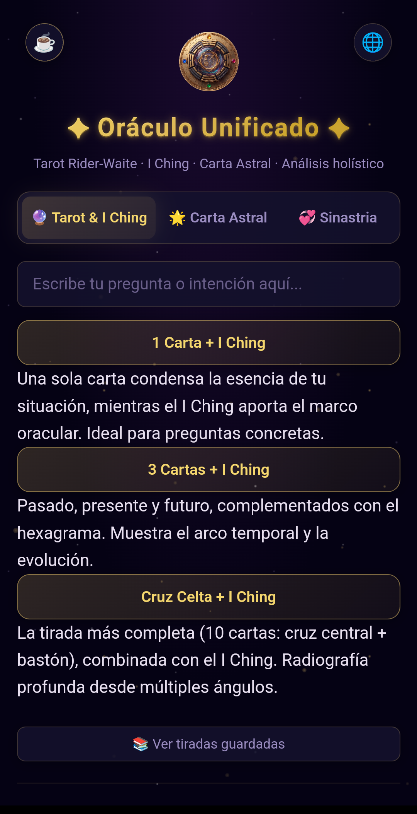
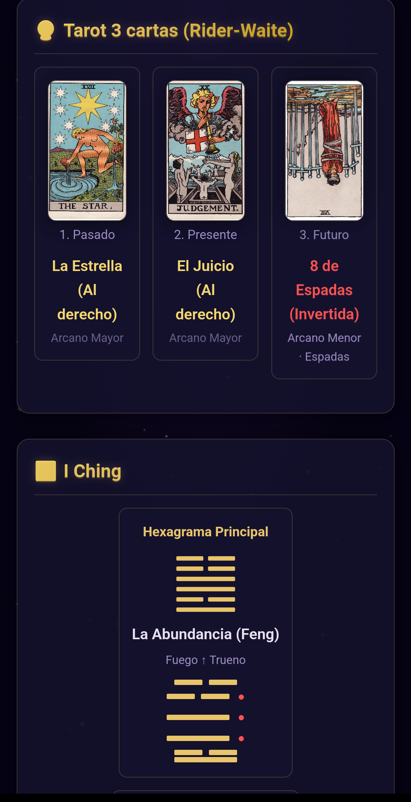
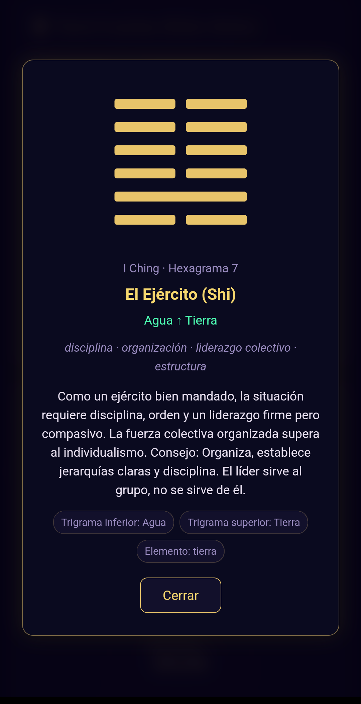
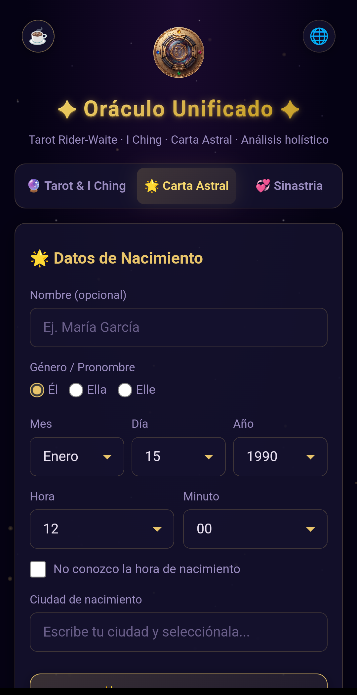
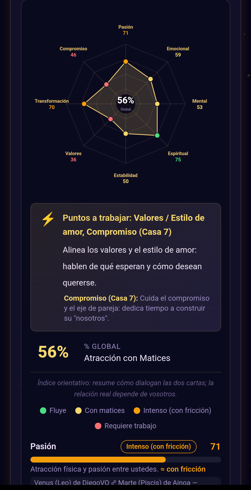
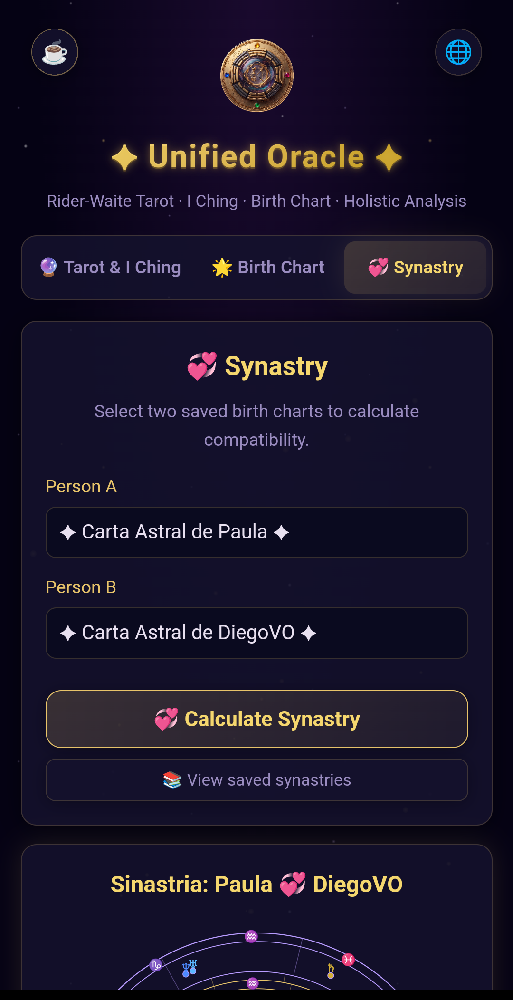

# 🔮 Oráculo Unificado

> Hybrid Android app that unites three divination disciplines in a single interface — **Tarot**, **I Ching** and **Natal Chart** (plus **Synastry**) — with optional AI-powered readings in 6 languages.

   

[Spanish](README.md) · **English**

No sign-up or accounts: the astronomical calculations and reading logic run entirely on your own device (Swiss Ephemeris and SQLite compiled to WASM), and your readings stay stored locally. The only cloud component is a lightweight AI proxy (Cloudflare Worker → Gemini), whose API key never leaves the server.

## ✨ Screenshots

<table>
  <tr>
    <td></td>
    <td></td>
    <td></td>
  </tr>
  <tr>
    <td></td>
    <td></td>
    <td></td>
  </tr>
  <tr>
    <td></td>
    <td><i>App shown in English (custom i18n)</i></td>
    <td><i>7 screens cover all 3 oracles + AI</i></td>
  </tr>
</table>

## 📥 Download

- **Google Play:** [https://play.google.com/store/apps/details?id=com.oraculounificado.app](https://play.google.com/store/apps/details?id=com.oraculounificado.app)
- Or **build your own APK**: see [Setup and development](#setup-and-development).

> **Status:** published on Google Play (production, 100% rollout). The app was built end to end by one person with AI-assisted development.

## Features

- **Tarot**: 1-card, 3-card (past/present/future) and Celtic Cross (10-card) spreads, rendered with responsive CSS Grid. Ships with a full illustrated deck and descriptions.
- **I Ching**: hexagram generation with changing lines, drawn in SVG, with interpretive text.
- **Natal Chart**: real astronomical calculation with **Swiss Ephemeris (WASM)** — planetary positions, houses, aspects, Part of Fortune and South Node. Interactive zodiac wheel in SVG. City database in SQLite (sql.js).
- **Synastry**: two-person compatibility: two natal charts combined, with an 8-factor compatibility panel and an octogonal radar chart.
- **AI analysis**: Gemini integration via a Cloudflare Worker (proxy), with a local holistic algorithm as offline fallback.
- **Share/Copy**: native buttons to copy and share results through the Android native share sheet (WhatsApp, email, Messages, etc.). Long results are attached as a temporary **PDF** so WhatsApp doesn't truncate them.
- **Multilanguage**: 6 languages (es, en, pt, fr, it, de) with a custom i18n system and real device-locale detection.
- **Persistence**: save/load readings and natal charts with local storage.

## Architecture

```
OraculoUnificado/
├── android/               # Native Android project (Capacitor)
│   ├── app/
│   │   ├── build.gradle    # Build config + release signing
│   │   ├── src/main/
│   │   │   ├── AndroidManifest.xml
│   │   │   ├── java/com/oraculounificado/app/
│   │   │   │   └── MainActivity.java   # JS↔Native bridges
│   │   │   └── res/                    # Resources, icons, splash
│   │   └── oraculo-release.keystore    # Signing keystore (NOT committed)
│   └── keystore.properties             # Keystore credentials (NOT committed)
│
├── js/                   # JavaScript source (ES modules)
│   ├── core/              # Logic: astrology, analysis, ai-api
│   ├── data/              # Data: tarot-kb, iching-kb, sqlite-db, swisseph WASM
│   ├── i18n/              # Internationalization + locales (6 languages)
│   ├── ui/                # UI: tarot, astral, modal, tabs, onboarding, donation
│   ├── storage.js         # Local persistence (saved readings/charts)
│   └── main.js            # Entry point
│
├── www/                  # Web root served by Capacitor (webDir)
│   ├── index.html
│   ├── styles.css
│   └── js/               # Copy of js/ (synced)
│
├── worker/               # Cloudflare Worker (Gemini AI proxy)
│   ├── oraculo-worker.js
│   └── wrangler.toml
│
├── scripts/             # Utility scripts and data generation
├── img/                  # Images (Tarot cards + screenshots)
├── capacitor.config.json
├── package.json
└── .env.example          # Environment variable template
```

## JS ↔ Native bridges (MainActivity.java)

The WebView exposes four `@JavascriptInterface`s from Java:

- **`AndroidClipboard.copy(text)` / `.read()`**: copies/reads the native clipboard (needed because `navigator.clipboard` doesn't work in a WebView without HTTPS).
- **`AndroidShare.share(text)`**: opens Android's native share sheet (`Intent.ACTION_SEND`). Universal compatibility strategy: short texts travel as `EXTRA_TEXT` (text/plain); long texts (>500 characters) are turned into a temporary **PDF** (native `PdfDocument` API, A4) attached via `FileProvider` with MIME `application/pdf` — so WhatsApp doesn't truncate the result the way it does with `EXTRA_TEXT`.
- **`AndroidOpenUrl.open(url)`**: opens external URLs in the system browser (`target="_blank"` links don't work in a WebView without HTTPS).
- **`AndroidLocale.get()`**: returns the device's real locale to initialize the language (in a WebView, `navigator.language` may return 'en-US' even on a Spanish device).

## Setup and development

### Requirements

- Node.js 18+
- Android Studio (SDK 34, Java 17)
- Cloudflare account (for the AI Worker, optional)

### Installation

```bash
# Install dependencies
npm install

# Copy the environment template and fill in the values
cp .env.example .env
# Edit .env with your VITE_WORKER_URL

# Sync www/ → android/app/src/main/assets/public/
npx cap sync android
```

### Build

```bash
# Debug APK
npm run build:apk:debug

# Signed release APK (requires keystore.properties)
cd android && ./gradlew assembleRelease

# Release AAB (for Play Store)
npm run build:bundle
```

The release APK is generated at:
`android/app/build/outputs/apk/release/app-release.apk`

### Release signing

The keystore (`oraculo-release.keystore`) and its credentials (`keystore.properties`) are in `.gitignore` and **are not uploaded to the repository**. To reproduce the signing:

1. Place `oraculo-release.keystore` in `android/app/`
2. Create `android/keystore.properties` with:
   ```properties
   storeFile=oraculo-release.keystore
   storePassword=<your_password>
   keyAlias=oraculo
   keyPassword=<your_password>
   ```

### Cloudflare Worker (AI)

The AI uses a Cloudflare Worker as a proxy to Gemini. The API key lives in the Worker's secrets, not in the client:

```bash
cd worker
npx wrangler secret put GEMINI_KEY
npx wrangler deploy
```

## Tech stack

| Layer      | Technology                             |
|-----------|----------------------------------------|
| Shell      | Capacitor 8 (Android WebView)          |
| UI         | HTML5 + CSS3 + ES modules (no framework) |
| Astral     | Swiss Ephemeris (WASM)                 |
| Data       | SQLite (sql.js / WASM)                 |
| AI         | Gemini via Cloudflare Worker           |
| Build      | Gradle 8 + R8/ProGuard                 |
| Java       | 17                                     |

## License

Proprietary. © Diego Villena.